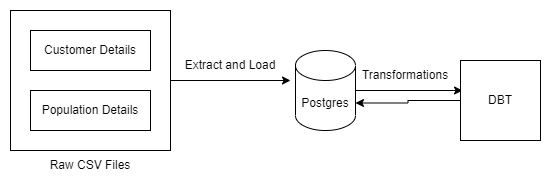

# ELT Pipeline

### About
This is an ELT data pipeline built using **Python**, **PostgreSQL** and **DBT**.
The dataset is taken from [Kaggle](https://www.kaggle.com/datasets/blastchar/telco-customer-churn).

*Pipeline architecture*

### About the pipeline

1. The data is extracted, processed and loaded to Postgres using Python.
2. DBT then performs transformations and tests from this Postgres database.
3. `./app` contains python code to extract and load the data to Postgres.
4. `./transformations` contains dbt code to perform transformations on top of Postgres data. 

### Running the project

1. Run `make up` or `docker-compose up --build`. This will initialize a postgres database `churn` and load the data from csv files into the database.
2. Install dbt using `pip install dbt-postgres`.
3. Make sure that your `~/.dbt/profiles.yml` has the profile mentioned in `./transformations/profiles.yml`.
4. Change directory to transformations `cd transformations`
5. Run `dbt run`.
6. This will create `staging` and `transformed` schema in the postgres database. `Staging` schema will only have views whereas `transformed` schema will have the tables.
7. To generate and view the docs, run the following 2 commands:
   1. `dbt docs generate`
   2. `dbt docs serve`
8. This will open up a server at [http://localhost:8080](http://localhost:8080) where you can view the docs, the lineage and the data models.
9. To run the tests, run `dbt test`.

### Things I learned

1. Pre-commit hooks to format and document python code like flake8, isort, interrogate and black.
2. Use of `Makefile`
3. Dockerizing a python application and using Postgres in docker.
4. Setting up dbt using CLI and connecting it with Postgres.
5. DBT tests, docs, doc blocks, macros, custom schema names, configurations etc.